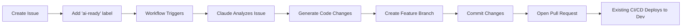

# AI Auto-Implementation Workflow

This workflow automatically implements GitHub issues labeled with `ai-ready` using Claude AI.

## Setup Instructions

### 1. Add Claude API Key to GitHub Secrets

1. Go to your repository settings: `https://github.com/Soloflex95/IMQ/settings/secrets/actions`
2. Click **"New repository secret"**
3. Name: `ANTHROPIC_API_KEY`
4. Value: Your Claude API key
5. Click **"Add secret"**

### 2. How It Works



### 3. Usage

**Step 1: Create an Issue**
```markdown
Title: Update welcome message on home page
Body: Change the welcome text from "Welcome to IMQ" to "Welcome to I aM Qualified"
```

**Step 2: Add the `ai-ready` label**
- The workflow will automatically trigger
- AI will analyze the issue and your codebase
- Code changes will be generated and committed
- A PR will be created automatically

**Step 3: Review and Merge**
- Review the AI-generated PR
- If approved, merge to `develop`
- Your existing GitHub Actions will deploy to dev environment

### 4. What the AI Can Handle

✅ **Currently Supported:**
- Simple text changes (like our "Requires Attention" → "Needs Attention" example)
- Single-file modifications
- Adding new methods or properties
- UI component updates
- Configuration changes

⚠️ **Limited Support (may need manual review):**
- Multi-file refactoring
- Database migrations
- Complex business logic
- Security-sensitive changes

❌ **Not Recommended:**
- Authentication/authorization changes
- Payment processing
- Compliance-critical features (always review manually)

### 5. Issue Writing Tips for Best Results

**Good Issue Example:**
```markdown
**Title:** Add search filter to Workers page

**Description:**
On the Team Management page (Workers.razor), add a search input box above 
the workers table that filters by worker name or email address.

**Acceptance Criteria:**
- Input box with placeholder "Search workers..."
- Real-time filtering as user types
- Case-insensitive search
- Use existing Bootstrap styling

**Files to modify:**
- src/IMQ.Web/Components/Pages/Workers.razor
```

**What Makes a Good AI-Ready Issue:**
1. **Clear and specific** - Describe exactly what needs to change
2. **Mention file paths** - If you know which files need updates
3. **Include examples** - Show before/after text, or reference similar code
4. **List acceptance criteria** - Help AI understand success conditions

### 6. Troubleshooting

**If the workflow fails:**
- Check the Actions tab for error logs
- Ensure your issue description is clear and specific
- The AI will comment on the issue with error details
- Remove and re-add the `ai-ready` label to retry

**If code changes are incorrect:**
- Close the AI-generated PR
- Add more details to the issue
- Re-add the `ai-ready` label to regenerate

### 7. Advanced: Customizing the AI Behavior

The workflow uses your `.github/copilot-instructions.md` as context, so the AI:
- Understands your project architecture
- Follows your coding conventions
- Respects compliance requirements
- Uses correct .NET 9 and Blazor patterns

To improve AI results, keep `copilot-instructions.md` updated with:
- New patterns and conventions
- Common gotchas
- Project-specific requirements

### 8. Security Considerations

🔒 **The workflow:**
- Only triggers on issues labeled `ai-ready` (you control when it runs)
- Creates PRs for review (never merges automatically)
- Uses GitHub Actions secrets for API keys
- Commits as `github-actions[bot]` user

⚠️ **Always review AI-generated code before merging**, especially for:
- Security-sensitive changes
- Database schema modifications
- API endpoints
- Authentication/authorization logic

### 9. Cost Considerations

- Claude API charges per token
- Typical issue implementation: $0.01 - $0.10
- Monitor your API usage at: https://console.anthropic.com/
- Set usage limits in your Anthropic account settings

### 10. Future Enhancements (Phase 2)

When you need more power, migrate to an MCP server for:
- Multi-step implementations
- Test generation
- Database migration creation
- Integration with Azure DevOps
- Custom approval workflows
- Multi-issue epic handling

---

## Example Workflow Run

1. **Issue Created:**
   ```
   Title: Change button color on login page
   Labels: ai-ready
   ```

2. **Workflow Output:**
   - ✅ Branch created: `ai/issue-42-1736524800`
   - ✅ Files modified: `src/IMQ.Web/Components/Pages/Login.razor`
   - ✅ PR created: #43
   - 💬 Comment added to issue with PR link

3. **Next Steps:**
   - Review PR #43
   - Merge to `develop`
   - Auto-deploy to dev environment triggers

---

**Ready to test?** Create a simple issue and add the `ai-ready` label!
